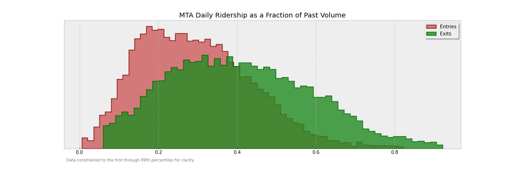
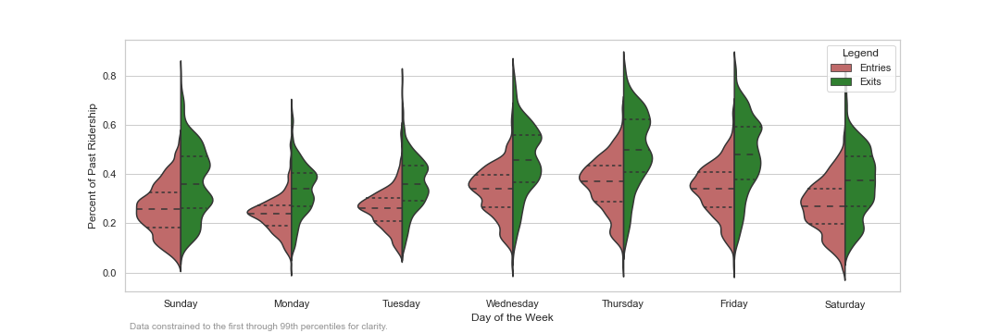

# Heterogeneity in Public Transit Usage During a Pandemic: The case of NYC
Peter Goff

## Abstract
A number of analyses have shown that ridership on NYC's subway system (MTA) has decreased during the 2020 covid pandemic. This reduction in MTA ridership was largely a result of the department of health's social distancing policies. Given the research on infection transmission and social proximity, the MTA trains and stations are a likely source of virus propagation. As such, a better understanding of MTA usage during an outbreak can help determine if and how ridership policies, such as limiting hours of operation or instituting daily maximums, may complement existing policy to slow the spread of the virus.

## Design
This exploratory analysis first sought to replicate the aggregate declines documented elsewhere and then to decompose the variance in those declines across time-of-day, day-of-week, and geographic clusters. I used three years of past ridership for the same month (July) as a comparative baseline to construct an accurate portrayal of ridership change. Findings are presented as a proportion of past usage.

## Data
This project draws from several publicly available data sets, centered primarily on [MTA Turnstyle data](http://web.mta.info/developers/turnstile.html). After cleaning and merging to incorporate GIS coordinates, the analytic dataset consists of 3,558,944 observations of 5,116 turnstyles across 426 station complexes clustered in 4-hour daily timeblocks for the month of July in 2017-2020.

## Algorithms
Data cleaning consisted largely of the identification and removal of duplicate records and reconciling idiosyncratic observations. Given the large size of the data realtive to the observations needing attention, erroneous and duplicate records were removed rather than imputed. Consistent with the goal of this inquiry, visualizations (histograms, violin plots, and mapping) were selected and/or modified to illustrate variation in addition to central tendency. 

## Tools
* Urllib.request was used for data retrevial from web sources.
* SQL (sqlite3) was used for initial data storage. 
* Sqlalchemy was used for data conversion.
* Numpy and Pandas libraries were applied for for data manipulation.
* Seaborn, Matplotlib, Geopandas, and Geoplot were used for data visualization.

## Communication
Findings were shared with Metis Data Science workgroup and posted on github.

### Acknowledgements
My thanks to the thoughtful feedback from Metis' staff, particularly Joan Wang, Chris Bruehl, Ian Livingston, and Kelsey Glenn. This inquiry was also built upon the shoulders of others who have engaged this dataset and provided code and insights, such as [Chris Whong](https://medium.com/qri-io/taming-the-mtas-unruly-turnstile-data-c945f5f96ba0). All errors are my own.
